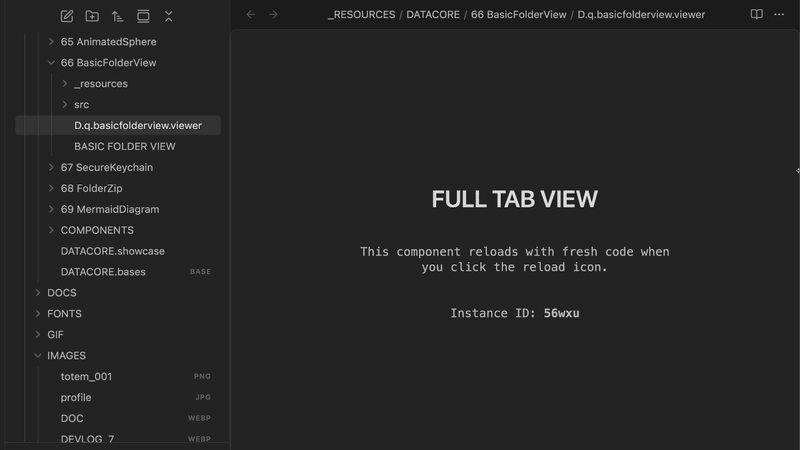

  
  
  <h1 align="center">BASIC VIEW</h1>
  <h3 align="center"> Tʜᴇ Hᴏᴛ-Rᴇʟ9ᴀᴅ W9ʀᴋsᴘᴀᴄᴇ Sʜᴇʟʟ </h3>

  <!-- TOP 3 BADGES (PURPLE) -->
  
  
  
   
  <!-- BOTTOM 3 BADGES (GOLD LUCIDE ICONS) -->
  
  
  
  

  

    <i> A developer UI shell featuring file-based hot-reloading and full-pane layout docking. </i>
  

  

Welcome to **Basic View**, a developer-focused layout shell designed to streamline the debugging, iteration, and display of custom React components within Obsidian's Datacore runtime. 

By wrapping your components in Basic View, you gain access to high-fidelity full-pane layout management and an automated file-based hot-reload mechanism that isolates code changes instantly.

---

## 🚀 Capabilities & Constraints

### What It Does
*   **Developer Hot-Reload**: Adds a reload icon that automatically reads the active note's full text, generates a temporary timestamped file under `_RESOURCES/temp`, and launches it inside a new leaf to trigger an isolated compiler reload with your latest changes.
*   **Dual-Mode Docking**: Renders inline as a simple compact placeholder or reparents itself globally in the DOM to occupy 100% of the active pane leaf for immersive layouts.
*   **Placeholder Restoration**: Maintains page integrity during leaf reparenting by substituting a virtual layout node, ensuring clean document flow when exiting full-tab mode.
*   **Clipboard Path Grabber**: Features a quick-access utility button in compact mode to copy the current codeblock's note path for fast filesystem navigation.

### What It Cannot Do
*   **Render Functionality Solo**: Basic View is designed strictly as a container shell; it requires a child component to host active content or application logic.
*   **Preserve UI State Across Sessions**: View state (compact/full-tab) is managed in volatile React state and defaults to full-tab upon component remounts.
*   **Prevent Active Leaf Switching**: The hot-reloader navigates the user's active leaf to the newly spawned temp file to isolate compiling caches.

---

## 📦 Directory Index & Components

The package exposes the following compiled files:

| File | Description |
| :--- | :--- |
| **[BASIC VIEW.md](BASIC%20VIEW.md)** | The main entry point designed to be loaded inside Obsidian canvases or workspace leaves. |
| **[src/App.jsx](src/App.jsx)** | Main bootstrap application loader that resolves and wires the underlying views. |
| **[src/BasicView.component.jsx](src/BasicView.component.jsx)** | High-fidelity React components (HMR Container and reparenting layouts). |
| **[METADATA.md](METADATA.md)** | Packaging manifest outlining indexing, target, and security configurations. |

---

## 🎨 UI Styling & Integration Rules
Basic View adheres strictly to standard Obsidian design tokens, ensuring cohesive rendering across both light and dark native themes:
*   Uses `var(--background-secondary)` for panel backgrounds and `var(--background-modifier-border)` for borders.
*   Uses standard typography sizing and margins to prevent structural shifts when transitioning from compact to full-pane modes.
